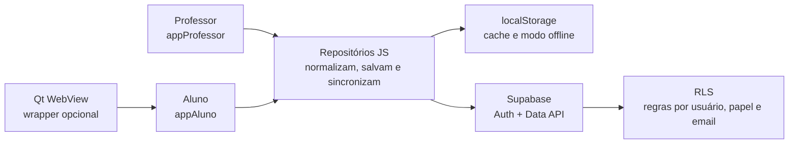
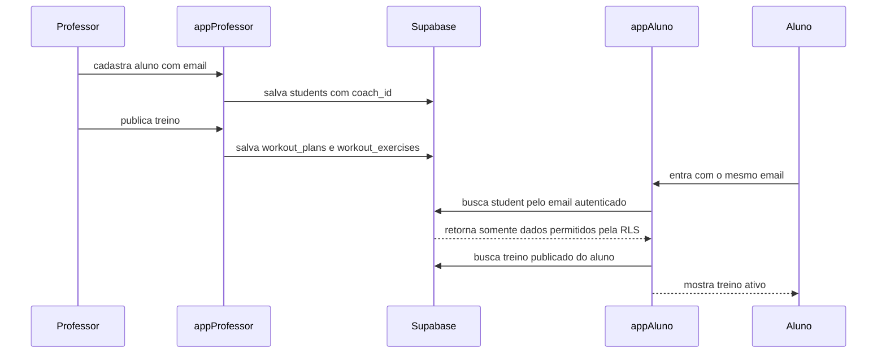

# FlowFit - Guia do Projeto

Este guia explica o projeto a partir do código que existe hoje neste workspace. A ideia é dar uma visão clara antes de entrar nos detalhes: primeiro o que o produto quer resolver, depois como as partes conversam, e só então onde mexer com cuidado.

Quando algo não está totalmente claro no código, está marcado como **precisa ser confirmado**.

## Em Uma Frase

FlowFit é uma plataforma web, mobile-first, para conectar personal trainer e aluno: o professor cadastra alunos, publica treinos e ajusta a marca do app; o aluno entra com o email cadastrado, vê o treino publicado, registra a execução e envia feedback.

O projeto foi feito sem framework de frontend. Ele usa HTML, CSS e JavaScript modular direto no navegador. O backend, quando usado, é o Supabase: ele cuida de login, banco de dados e regras de acesso.

## A Imagem Mental Mais Simples

Pense no sistema como dois balcões atendendo o mesmo negócio:

- o **app do aluno** é o balcão de execução: treino de hoje, registro de séries, evolução, agenda local e perfil;
- o **painel do professor** é o balcão de operação: alunos, treinos, marca branca, perfil profissional e acompanhamento;
- o **Supabase** é a sala de arquivos com fechadura: guarda contas, alunos, treinos, temas e execuções, e decide quem pode abrir cada gaveta.

Os dois apps não passam por um servidor próprio do projeto. Eles falam diretamente com o Supabase usando a chave pública configurada no frontend. A proteção dos dados não está nessa chave; está nas regras de acesso do banco.



## Objetivo Do Projeto

O objetivo atual é criar a base de um produto de treino que funcione bem como app web e possa evoluir para PWA e WebView nativo.

O produto quer reduzir trabalho operacional do personal. Em vez de passar treino por mensagem, planilha ou PDF solto, o professor cadastra o aluno, publica o treino e recebe de volta sinais da execução: séries feitas, cargas, repetições, volume e feedback simples.

O projeto também já carrega uma ideia importante de produto: **marca branca**. O personal pode ajustar nome, frase, cores, fonte, arredondamento e estilo visual do app do aluno. Logo e foto do personal existem hoje como preview/cache local, mas ainda não são enviados para Supabase Storage.

## Como O Sistema Funciona Por Cima

Há três camadas principais.

**Interface**

São os arquivos `index.html`, CSS e `app.js` de cada app. O HTML define a estrutura das telas. O JavaScript procura elementos por atributos como `data-student-list`, `data-workout-form` e `data-finish`, renderiza dados neles e conecta eventos de clique, envio de formulário e navegação por hash.

**Repositórios**

Os arquivos em `appAluno/js/data/repositories/` são a ponte entre interface, cache local e Supabase. Neste projeto, "repositório" quer dizer: um módulo que sabe como ler, salvar, normalizar e sincronizar um tipo de dado.

Exemplo: o painel não monta uma linha SQL para salvar treino. Ele cria um treino no formato do app e chama `workoutRepository.syncPublishedWorkout()`. Esse repositório decide como salvar no `localStorage`, como transformar os campos para o formato do banco e como lidar com falhas.

**Core**

Os arquivos em `appAluno/js/core/` guardam peças compartilhadas e mais estáveis: acesso ao `localStorage`, detecção de plataforma, tema, tokens visuais, ícones e criação do cliente Supabase.

O ponto importante é que o painel do professor também importa vários desses módulos do app do aluno. Isso evita que os dois lados passem a entender "aluno", "treino" ou "tema" de formas diferentes.

## Principais Partes

### App Do Aluno

Fica em `appAluno/`.

Ele é a experiência mobile do aluno. As telas principais são:

- início, com resumo do treino e da semana;
- treino, com exercícios, séries, descanso, carga, repetições e finalização;
- evolução, com check-ins locais de peso e medidas;
- agenda, com lembretes locais;
- notificações, ainda locais/demonstrativas;
- perfil, com dados do aluno, personal e aparência.

O fluxo principal começa bloqueado pelo onboarding/login. Depois que o aluno autentica, o app procura um aluno cadastrado com o mesmo email da sessão Supabase. Se encontrar, carrega o treino publicado para esse aluno. Se não encontrar, entra em estado real vazio: a conta existe, mas aquele email ainda não foi cadastrado por um personal.

### Painel Do Professor

Fica em `appProfessor/`.

Ele é o lugar onde o personal opera a base. Hoje inclui:

- autenticação como professor;
- dashboard com indicadores e pendências;
- cadastro manual de alunos;
- importação simples de alunos por CSV;
- convite rápido para aluno, com link para `appAluno` e email preenchido na URL;
- criação e edição de treinos publicados;
- preview de exercícios interpretados a partir de linhas como `Supino reto 4x10`;
- editor de marca branca;
- perfil profissional;
- áreas de comunicação e negócio ainda não configuradas de verdade.

O painel só libera operação depois que a conta autenticada tem perfil com papel `coach`. Se a conta for de aluno, o painel bloqueia o uso.

### Supabase

Fica configurado em `appAluno/js/config.js` e modelado em `supabase/schema.sql`.

O Supabase faz três papéis:

- **Auth**: login por email/senha, recuperação de senha e OAuth Google;
- **Data API**: uma API HTTP automática para ler e gravar tabelas do banco;
- **RLS**: Row Level Security, ou segurança por linha. Na prática, são regras no banco que dizem: "este usuário pode ver esta linha?".

Não existe backend próprio neste repositório. Por isso, as regras de segurança precisam estar no banco. Esconder botão na interface ajuda a experiência, mas não protege dado sozinho.

### Wrapper Qt/WebView

Existe um diretório `qtWebView/` neste workspace com código C++/QML. Ele abre `https://physikflow.github.io/FlowFit/appAluno/` dentro de uma WebView e, se a página remota falhar, usa uma cópia offline de `appAluno`.

Ao mesmo tempo, o `.gitignore` atual ignora `qtWebView/` inteiro e comenta que o repositório versiona apenas o produto web/site. Portanto, o papel oficial desse wrapper no repositório **precisa ser confirmado**. Ele existe localmente, mas está fora do conjunto versionado pelo Git.

## Como Os Dados Percorrem O Sistema

### 1. Professor Cadastra Um Aluno

No painel, o professor preenche nome, email, objetivo e status.

O código cria um aluno com:

- `id`, usado como identificador principal;
- `coachId`, que normalmente vira o `auth.uid()` do professor;
- `studentKey`, uma versão simples do nome para compatibilidade e fallback;
- `email`, que é o elo mais importante para o aluno conseguir encontrar seus dados;
- campos operacionais como objetivo, plano, status, aderência e próxima ação.

O aluno é salvo primeiro no `localStorage`, na chave `flowfit.students`. Depois o painel tenta sincronizar com a tabela `students`.

Esse comportamento é "local-first": a interface responde rápido e continua útil em cenário offline, mas tenta mandar a verdade para a nuvem quando a sessão permite.

### 2. Professor Publica Um Treino

No formulário de treino, o professor escolhe o aluno, escreve um título e cola exercícios linha por linha.

Exemplo:

```text
Supino reto 4x10
Crucifixo 3x12
Tríceps corda 3x15
```

O parser em `workout-repository.js` entende principalmente o padrão `nome + número x repetições`. Se a linha não encaixa perfeitamente, ele ainda cria um exercício estimado, em vez de travar a publicação.

Ao publicar, o painel:

1. monta um objeto de treino;
2. salva no cache local `flowfit.published-workouts`;
3. atualiza o aluno localmente para apontar para o treino;
4. se o professor está autenticado, sincroniza:
   - `students`;
   - `workout_plans`;
   - `workout_exercises`.

Quando um treino já existe e é editado, a versão aumenta.

### 3. Aluno Entra E Recebe O Treino

O aluno autentica no `appAluno`.

Depois disso, o app:

1. garante que existe um perfil `student`;
2. busca em `students` uma linha cujo email bate com o email autenticado;
3. busca treinos publicados;
4. escolhe o treino mais recente elegível para aquele aluno.

Elegível, aqui, quer dizer que o treino está publicado e sua data `startsAt` já chegou. Um treino agendado para o futuro aparece no painel como agendado, mas o aluno só deve recebê-lo quando chegar a data.



### 4. Aluno Finaliza Um Treino

Durante o treino, o aluno marca séries e pode ajustar carga e repetições por exercício. O app guarda esse progresso no estado local para não perder tudo em uma navegação simples.

Ao finalizar, o app cria uma sessão com:

- treino e versão;
- aluno;
- total de séries e séries concluídas;
- volume em kg;
- duração;
- logs por exercício;
- feedback de esforço, dor/desconforto e nota livre.

Essa sessão é salva localmente e depois enviada para:

- `workout_sessions`;
- `workout_set_logs`;
- `workout_feedback`.

Há duas camadas locais relacionadas a sessões:

- `flowfit.aluno.state`, usado pelo app do aluno para histórico e estado da tela;
- `flowfit.workout-sessions`, usado pelo `sessionRepository` como cache de sessões sincronizáveis.

No painel, existe código para renderizar um painel de execuções do aluno e uma função `refreshWorkoutSessions()`. Porém, no código atual, não encontrei um listener ligando o botão `data-refresh-sessions` a essa função. Essa é uma dívida concreta.

### 5. Professor Ajusta A Marca Branca

O professor edita marca, frase, cores, fonte, arredondamento e estilo de fundo.

Antes de salvar, o painel calcula contraste entre texto, fundo e superfícies. Contraste, aqui, é a diferença de luminosidade entre duas cores. Se for baixo, o texto pode ficar difícil de ler. O código exige pelo menos `4.5:1`, que é um bom limite prático para legibilidade.

O tema é salvo localmente e, com professor autenticado, sincronizado na tabela `brand_theme`. O app do aluno busca esse tema no início e aplica os tokens CSS.

## Autenticação, Banco, API E Interface

O login é centralizado em `auth-repository.js`.

Quando alguém entra ou cria conta, o repositório:

1. chama Supabase Auth;
2. garante um registro em `profiles`;
3. grava ou valida o papel da conta: `coach` para professor ou `student` para aluno;
4. devolve um contexto com usuário, email, perfil, papel e `coachId`.

O `coachId` é especialmente importante. Para o professor, ele é o `id` do usuário autenticado. Quase tudo que o professor grava recebe esse valor. Isso permite separar dados de um personal dos dados de outro.

Para o aluno, o acesso é mais indireto: o aluno pode ler dados vinculados ao seu `student_user_id` ou ao email autenticado. Isso permite o fluxo atual em que o professor cadastra primeiro o email e o aluno cria a conta depois.

No banco, essas regras vivem em `supabase/schema.sql` como policies de RLS. A interface pode até tentar buscar dados de outro aluno, mas o banco deve barrar se as policies estiverem corretas.

## Onde Ficam As Regras Importantes

As regras mais importantes não ficam todas em um lugar só.

`supabase/schema.sql` guarda o formato oficial dos dados e as regras de acesso. Sempre que uma mudança envolve privacidade, vínculo professor-aluno ou novas tabelas, comece por aqui.

`appAluno/js/data/repositories/auth-repository.js` define como login, criação de conta, recuperação de senha, OAuth e perfil funcionam. Também impede que uma conta já criada como aluno seja usada como professor, e vice-versa.

`appAluno/js/data/repositories/student-repository.js` define como alunos são normalizados, mesclados, salvos localmente e sincronizados. A regra de "mesmo email no mesmo professor atualiza o aluno" passa por esse módulo e pelo painel.

`appAluno/js/data/repositories/workout-repository.js` define como um treino é criado, interpretado, versionado, salvo e sincronizado. É também onde fica o parser das linhas de exercício.

`appAluno/js/data/repositories/session-repository.js` define como uma execução de treino vira linhas no banco: sessão principal, logs por exercício e feedback.

`appAluno/js/core/brand-theme.js` define os tokens de tema, normaliza cores e calcula contraste. Se mudar a experiência de marca branca, esse arquivo é mais importante que o CSS isolado.

`appAluno/js/core/store.js` guarda o estado local do app do aluno: onboarding, séries marcadas, cargas/reps digitadas, check-ins, sessões locais, agenda e notificações lidas.

`appAluno/sw.js` controla o cache do PWA. Se algum arquivo antigo continuar aparecendo no GitHub Pages, esse arquivo e o número do cache entram na investigação.

## Arquivos E Pastas Mais Importantes

`appAluno/` é o app do aluno. O ponto de entrada é `appAluno/index.html`, e a lógica principal está em `appAluno/js/app.js`.

`appProfessor/` é o painel do personal. O ponto de entrada é `appProfessor/index.html`, e a lógica principal está em `appProfessor/js/app.js`.

`appAluno/js/core/` contém peças compartilhadas: plataforma, storage, tema, Supabase e ícones.

`appAluno/js/data/repositories/` contém a camada de dados usada pelos dois apps.

`appAluno/css/` contém tokens, componentes compartilhados e composição visual do app do aluno. O painel reaproveita `tokens.css` e `components.css`.

`appProfessor/css/app.css` contém a composição visual própria do painel.

`supabase/schema.sql` é a referência do banco e da autorização.

`README.md` explica execução e configuração rápida.

`PLANEJAMENTO.md` guarda visão de produto, princípios e roadmap.

`qtWebView/` contém um wrapper Qt local, mas está ignorado pelo Git. Precisa ser confirmado se faz parte oficial do repositório.

## Como Executar O Projeto Web

Como o projeto usa módulos JavaScript e Service Worker, sirva por HTTP. Não conte com abrir o HTML direto pelo explorador de arquivos.

Na raiz do projeto:

```powershell
python -m http.server 8080
```

Depois abra:

```text
http://localhost:8080/appProfessor/
http://localhost:8080/appAluno/
```

Para usar Supabase de verdade:

1. rode `supabase/schema.sql` no SQL Editor do projeto Supabase;
2. configure as URLs de redirect no painel de Authentication do Supabase;
3. confira `SUPABASE_URL` e `SUPABASE_ANON_KEY` em `appAluno/js/config.js`;
4. configure o provedor Google no Supabase se quiser login social.

A chave `SUPABASE_ANON_KEY` atual é uma chave publicável. Ela pode estar no frontend. O que não pode ir para GitHub Pages é chave `service_role` ou qualquer segredo com poder administrativo.

## Como Executar O Wrapper Qt

O wrapper está documentado em `qtWebView/README.md`. Em resumo, ele exige Qt 6 com Qt Quick e Qt WebView, além do kit de plataforma escolhido.

No Windows Desktop, o README usa `qt-cmake.bat`, CMake e `windeployqt`. No Android, usa o kit Android do Qt, JDK, SDK, Build Tools e NDK.

Como `qtWebView/` está ignorado pelo `.gitignore`, trate essa parte como ambiente local até ser confirmado que ela deve entrar no versionamento.

## Como Testar Os Principais Fluxos

### Fluxo Professor Para Aluno

1. Abra `appProfessor/`.
2. Crie ou entre com uma conta de professor.
3. Cadastre um aluno com nome e email real de teste.
4. Publique um treino para esse aluno. Use linhas simples, por exemplo:

```text
Agachamento livre 4x8
Leg press 3x12
Cadeira extensora 3x15
```

5. Abra `appAluno/`, de preferência com `?email=aluno@teste.com` para preencher o email.
6. Crie ou entre com uma conta de aluno usando o mesmo email cadastrado.
7. Confirme que o treino aparece no app do aluno.

### Execução De Treino

1. No app do aluno, abra a tela Treino.
2. Marque todas as séries de cada exercício.
3. Altere carga e repetições em pelo menos um exercício.
4. Preencha feedback de esforço, dor/desconforto e nota.
5. Clique em concluir.
6. Confira se o histórico local do aluno foi atualizado.
7. Se o Supabase estiver configurado, verifique as tabelas `workout_sessions`, `workout_set_logs` e `workout_feedback`.

No painel do professor, o código para buscar execuções existe, mas o botão de atualização parece não estar conectado. Para validar o fluxo completo no painel, essa ligação precisa ser implementada ou confirmada.

### Marca Branca

1. Entre no painel do professor.
2. Vá para Aparência.
3. Altere nome, frase, cores, fonte e arredondamento.
4. Tente uma combinação com pouco contraste e confirme que o painel bloqueia ou alerta.
5. Salve o tema.
6. Abra o app do aluno com uma conta vinculada ao professor e confirme que o tema é aplicado.

### Segurança Básica

1. Entre no painel com uma conta criada como aluno. O painel deve bloquear.
2. Entre no app do aluno com uma conta criada como professor. O app do aluno deve bloquear.
3. Entre como aluno com um email ainda não cadastrado pelo professor. O app deve autenticar, mas mostrar estado vazio.
4. Tente usar dois professores diferentes com alunos de mesmo email. A intenção do schema é isolar por `coach_id`; valide isso no Supabase antes de produção.

## Onde Normalmente Fazer Alterações

Para mudar texto, estrutura de telas ou campos visíveis, comece pelos `index.html` e pelo `app.js` correspondente.

Para mudar visual compartilhado, use `appAluno/css/tokens.css` e `appAluno/css/components.css`. Para detalhes só do app do aluno, use `appAluno/css/app.css`. Para detalhes só do painel, use `appProfessor/css/app.css`.

Para mudar como alunos são salvos ou mesclados, vá ao `student-repository.js`.

Para mudar publicação, edição, parser ou agendamento de treino, vá ao `workout-repository.js` e depois ao `appProfessor/js/app.js`.

Para mudar conclusão de treino, logs, feedback ou envio ao professor, vá ao `session-repository.js` e ao trecho de finalização em `appAluno/js/app.js`.

Para mudar login, criação de conta, papéis ou perfil, vá ao `auth-repository.js` e ao `supabase/schema.sql`.

Para mudar marca branca, comece em `brand-theme.js`, depois ajuste o editor no painel.

Para adicionar uma nova entidade sincronizada, pense em três lugares ao mesmo tempo: tabela/policy no Supabase, repositório JS e tela que consome esse dado.

## Áreas Que Exigem Mais Cuidado

**RLS no Supabase**

RLS é a fechadura real. Qualquer mudança em tabelas de aluno, treino, sessão, feedback ou tema precisa preservar a separação entre professores e alunos. Teste com contas diferentes, não só com a conta feliz do desenvolvimento.

**Email como vínculo do aluno**

Hoje o aluno encontra seu cadastro principalmente pelo email autenticado. Isso é prático para convite, mas sensível a erros de digitação, troca de email e alunos com mais de um personal.

**Cache local**

O app salva muita coisa no `localStorage`. Isso é bom para protótipo e offline, mas cria situações em que o navegador mostra dado antigo. Ao investigar bugs estranhos, confira as chaves `flowfit.*`.

**Service Worker**

O app do aluno registra `sw.js`. Em produção, cache antigo pode mascarar correções. Quando mudar arquivos cacheados, atualize o `CACHE_NAME` e revise a lista `APP_SHELL`.

**Formato dos treinos**

O parser atual é simples. Ele entende bem entradas como `Supino reto 4x10`, mas prescrições mais ricas podem virar estimativas. Se o produto avançar para treino realmente prescritivo, essa parte precisa ficar mais estruturada.

**Sincronização local-first**

Muitos salvamentos acontecem localmente antes da nuvem. Isso melhora a sensação de uso, mas exige estratégia de retry. No código atual, há `syncStatus` e mensagens de falha, mas não vi uma fila robusta de reenvio automático.

**Migrações de schema**

Os repositórios têm fallbacks para colunas antigas em alguns pontos. Isso ajuda durante evolução, mas também pode esconder que o banco está atrasado. Quando aparecer mensagem de sincronização parcial, rode o SQL atualizado e confira as colunas.

## Decisões Técnicas Atuais

O projeto escolhe web simples antes de framework. Isso reduz dependência de build e deixa o GitHub Pages viável.

Supabase é usado como backend pronto. O frontend importa `@supabase/supabase-js` por CDN, de forma lazy, em `core/supabase.js`. "Lazy" aqui quer dizer que o cliente só é carregado quando alguém realmente pede Supabase.

Os dados são tratados como objetos do app em camelCase, enquanto o banco usa snake_case. A conversão fica nos repositórios. Isso mantém a interface mais limpa.

O tema é tratado como dado, não como CSS solto. O professor escolhe valores; o código normaliza e aplica tokens CSS.

O app do aluno é preparado para PWA. PWA significa "Progressive Web App": um site que pode se comportar mais como aplicativo instalado, com manifesto e Service Worker.

O código de plataforma passa por `Platform`. Hoje ele chama APIs do navegador como `localStorage`, `navigator.share` e `navigator.vibrate`. Em WebView, essa camada é o lugar natural para adaptar comportamento nativo.

## Limitações E Dívidas Conhecidas

Não encontrei testes automatizados, `package.json` ou pipeline de build/teste no código versionado. Os testes hoje parecem ser manuais.

Comunicação, financeiro, agenda real, cobrança, chat, push notifications, avaliações completas e importação avançada ainda são roadmap ou estados vazios.

Check-ins de evolução, lembretes, notificações lidas e parte do histórico ainda ficam locais no aparelho.

Logo e foto do personal ficam em `localStorage` como Data URL. Ainda não usam Supabase Storage.

O botão de atualizar execuções no painel é renderizado, e a função de busca existe, mas a ligação entre eles não apareceu no código atual. Isso deve ser corrigido antes de depender desse painel para acompanhamento real.

`DEMO_COACH_ID` ainda existe como fallback em `config.js` e nos repositórios. No fluxo autenticado, o `coachId` vem do usuário logado, mas esse fallback merece revisão antes de produção.

`qtWebView/` existe localmente, mas está ignorado pelo Git. Precisa ser confirmado se o wrapper nativo deve ser mantido neste repositório, movido para outro ou versionado em uma etapa futura.

Não há backend próprio para validações complexas. Tudo que for regra sensível precisa estar no Supabase, principalmente nas policies de RLS.

## Pequeno Vocabulário Do Projeto

**Local-first**: salva primeiro no navegador e tenta sincronizar depois. Bom para fluidez e offline, mas precisa cuidado com conflito e retry.

**Repositório JS**: módulo que concentra leitura, escrita, normalização e sincronização de um tipo de dado.

**RLS**: regra de segurança por linha no Supabase. Ela decide se o usuário autenticado pode ver ou alterar uma linha específica.

**Auth context**: conjunto de informações da sessão atual: usuário, email, perfil, papel e `coachId`.

**Marca branca**: configuração visual que permite que o app do aluno pareça pertencer ao personal, não apenas ao FlowFit.

**Service Worker**: script do navegador que intercepta requisições e cacheia arquivos para comportamento de PWA/offline.

## Para Entrar No Código Sem Se Perder

Um bom caminho de leitura é:

1. `README.md`, para rodar;
2. `appProfessor/js/app.js`, para entender como o professor cria alunos e treinos;
3. `appAluno/js/app.js`, para entender como o aluno consome e executa;
4. `appAluno/js/data/repositories/`, para entender persistência e sincronização;
5. `supabase/schema.sql`, para entender o que realmente protege os dados.

Depois disso, o projeto fica bem menos misterioso: as telas são grandes, mas a lógica gira em torno de poucos contratos de dados compartilhados.
